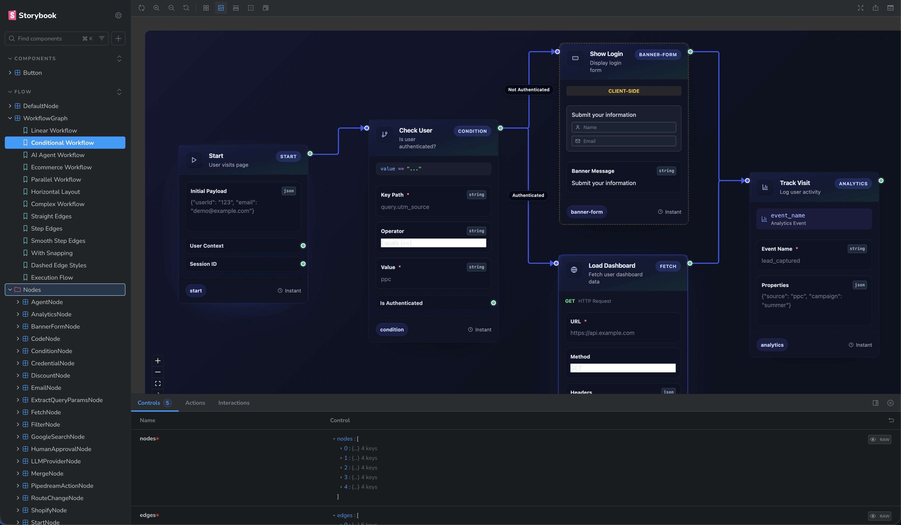
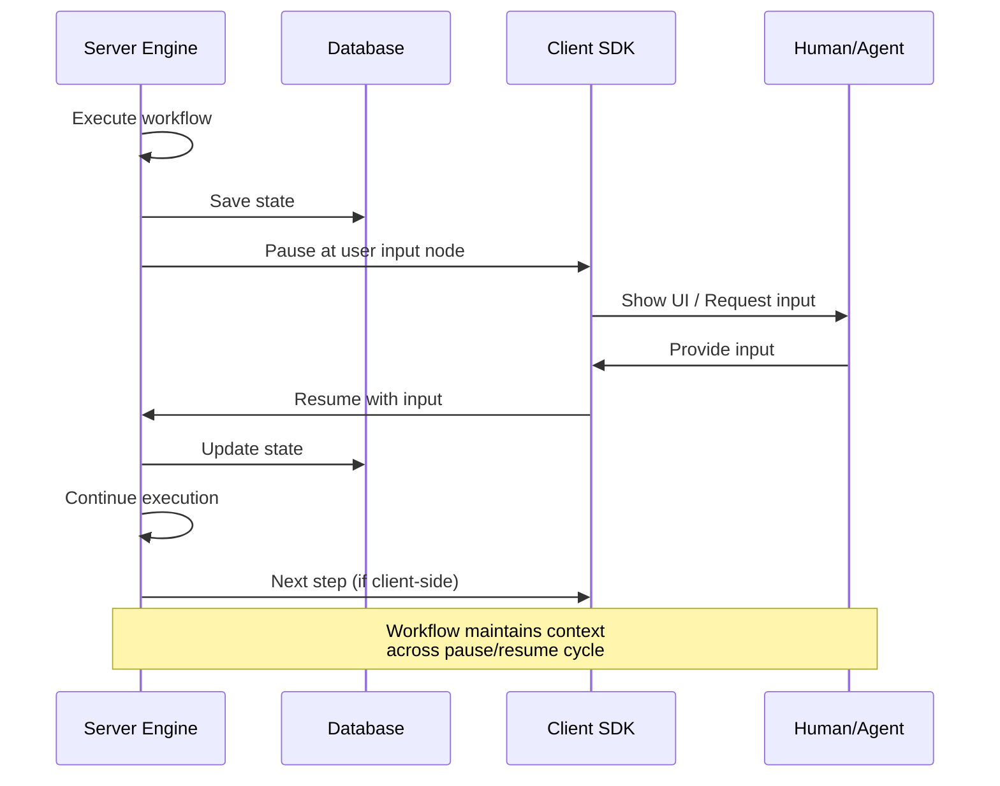
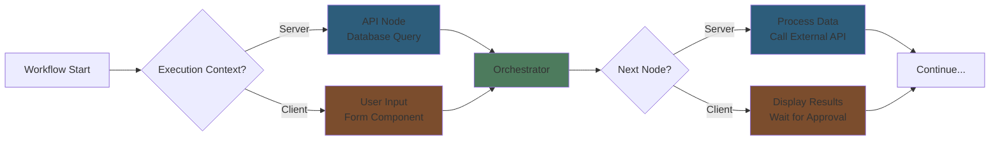
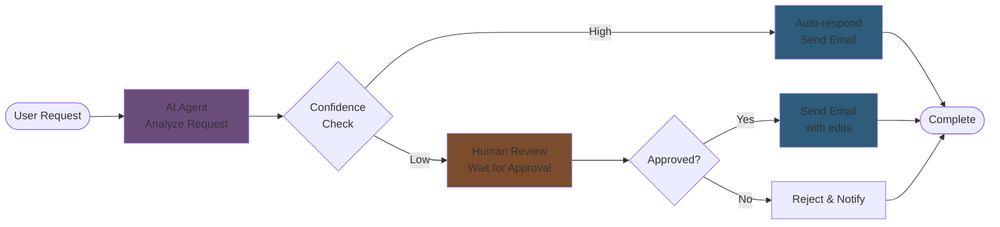
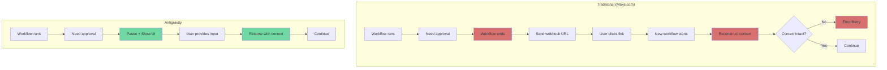
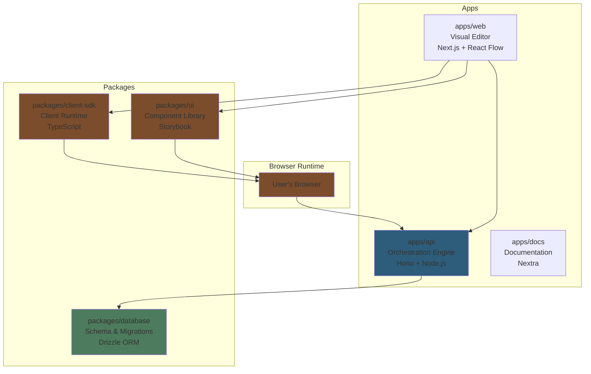

# Antigravity 🚀

[](https://linkedin.com/in/dougsilkstone)
[](https://withseismic.com)

## What is this?

Hey everyone - I was interested in hearing about how Make.com is looking to modernize their engine, and I wanted to take a stab at exploring this problem space to show how I run with an idea through to delivery.

I spent yesterday testing whether I could build something that would be super difficult (or impossible) to do cleanly in Make.com or N8N: workflows that pause for human or AI agent input and resume with full context intact.



## The exploration

Most workflow automation platforms assume everything runs on a server somewhere, completely detached from the user. But a lot of real workflows need humans in the loop - approvals, decisions, data entry, whatever. Or they need AI agents to jump in and do something.

The question: what if workflows could run partially in the browser? What if they could pause, show a UI, wait for input, and then resume with that context intact - without webhook hell or state reconstruction nightmares?



### Client-side execution

Traditional automation tools like N8N and Make.com are server-first. Everything happens on the backend. That's fine for pure automation, but it makes human interaction clunky.

Antigravity flips this. Workflows can have:
- **Server-side nodes** - heavy lifting, API calls, database stuff
- **Client-side nodes** - user input, dynamic UIs, instant feedback
- **Orchestration between both** - seamless handoff across environments

The engine coordinates execution across the stack. Workflows feel more like interactive apps than background jobs.



### The visual language

I'm building this with a component-driven approach. Every node, every primitive, every UI element lives in Storybook. You can see it all, test it in isolation, understand how it works.

The goal is a visual language for workflows that's actually composable and reusable - not just a bunch of one-off integrations.

Here's an example of a workflow that mixes AI and human decision-making:



This is the kind of workflow that's awkward in traditional automation platforms - you'd need webhooks, polling, or complex state management. Here it's just nodes in a graph.

And here's what it actually looks like in Storybook:


The workflow pauses at the "Human Review" node, shows a UI to the person (or waits for an agent), gets their input, and continues. State is preserved throughout.

## Problems with server-only automation

Make.com and similar platforms have a fundamental issue: they're built for unattended automation, so human interaction is bolted on as an afterthought.

Here's what breaks when you try to add human-in-the-loop to a server-only platform:

### 1. Webhook hell for approvals

Need a human approval in your workflow? On Make.com you:
- End the workflow
- Send a webhook URL via email/Slack
- User clicks link → hits webhook → triggers a new workflow
- New workflow has to reconstruct the original context using correlation IDs
- Hope nothing breaks in between

This is fragile. You're duct-taping together separate workflow executions and praying the state makes it through.

### 2. No real-time feedback

User can't see what's happening. They get an email 30 seconds later. Want live updates? You're polling an API endpoint every few seconds, wasting server resources and still seeing stale data.

### 3. State management nightmare

To pause and resume a workflow, you need to:
- Serialize all context to a database
- Generate a resume token
- Store correlation IDs
- Build webhook handlers to match resumed workflows to original state
- Handle timeouts, expirations, and orphaned workflows

It's complex, error-prone, and expensive to maintain.

### 4. Context switching kills UX

User gets an email: "Approve this workflow step". They click, land on some generic approval page with no context about what they were doing. They have to remember what this was about, make a decision, submit, then go back to what they were doing.

The workflow isn't integrated into their actual work - it's interrupting it.

### 5. Limited interactivity

Everything has to be pre-configured. Can't show dynamic forms based on previous steps. Can't do progressive disclosure. Can't have rich UI components. You're limited to static forms and basic input fields.

## How client-side execution fixes this

Antigravity flips the model:



### Real-time state sync

Workflow state lives in the browser. User sees live updates. No polling. No stale data. The UI reflects the current execution state instantly.

### Preserved context

When a workflow pauses, it doesn't end. The execution context stays alive. Variables, data, everything is intact. When the user provides input, execution resumes right where it left off.

### Integrated UX

The workflow UI lives in your app. User doesn't context switch. They see the workflow step inline, provide input, and keep working. No emails, no external links, no cognitive overhead.

### Rich interactivity

Client-side nodes can render any React component. Dynamic forms, conditional fields, file uploads, rich text editors - whatever you need. The workflow isn't limited to server-side constraints.

### Efficient architecture

No webhook infrastructure to maintain. No polling. No correlation ID tracking. The client SDK handles state management. The server orchestrates execution. Clean separation of concerns.

## What's in here

- Visual workflow editor (React Flow)
- Storybook component library - every node documented and testable
- Async orchestration engine that works across server and client
- TypeScript SDKs for both environments
- Human-in-the-loop primitives (user input, approvals, AI agent integration)
- Real-time state sync

## Getting started

You'll need Node.js 20+, pnpm 9+, and Docker (for the database).

```bash
# Clone and install
git clone https://github.com/your-org/antigravity.git
cd antigravity
pnpm install

# Set up env
cp .env.example .env
# Edit .env with your database credentials

# Start the database
docker-compose up -d db

# Run everything
pnpm dev
```

This starts:
- API at http://localhost:3002
- Web app at http://localhost:3000
- Docs at http://localhost:3001

### Check out Storybook

To see all the workflow nodes and components:

```bash
cd packages/ui
pnpm storybook
```

This opens the component explorer where every node is documented and interactive. You can test individual pieces of the workflow system in isolation.

### Metrics (Prometheus)

Start Prometheus locally to scrape the worker metrics server:

```bash
docker compose up -d prometheus
```

- Config: `prometheus/prometheus.yml` (scrapes `host.docker.internal:9464/metrics` by default)
- UI: http://localhost:9090
- Ensure the worker is running with the `METRICS_*` env vars from `.env.example` so Prometheus can reach it.

## How it's structured

This is a monorepo with [Turbo](https://turbo.build/):

- `apps/api` - The orchestration engine and API (Hono, Node.js)
- `apps/web` - Visual workflow editor (Next.js, React Flow)
- `apps/docs` - Documentation (Nextra)
- `packages/client-sdk` - Client-side SDK for running workflows in the browser
- `packages/ui` - Component library with all the nodes and primitives (Storybook)
- `packages/database` - Database schema (Drizzle ORM)



### The component library

`packages/ui` is where the visual language lives:

- Flow primitives - conditionals, loops, data transforms
- Node components - reusable workflow building blocks
- Interactive elements - UI components that can live inside workflows
- All documented in Storybook with examples

The idea is to have real, tested components that work the same in the visual editor and at runtime. Not just a drag-and-drop UI that generates config - actual executable components.

## Documentation

When you run `pnpm dev`, docs are at http://localhost:3001

- Introduction - why this exists
- Engine concepts - how the orchestration works
- Client SDK - integrating with your frontend
- React SDK - hooks and components
- Deployment - getting this running in production

## Current status

This is still early. I'm hardening it for production use, but it's not there yet.

See [PRODUCTION_READINESS.md](./PRODUCTION_READINESS.md) for what needs to be done and [PRODUCTION_HARDENING_GUIDE.md](./PRODUCTION_HARDENING_GUIDE.md) for explanations of all the infrastructure concepts.

Right now I'm working on:
- Worker reliability and queue management
- Node-specific retry configurations
- Observability (structured logging, Prometheus metrics)
- Resilience patterns (dead letter queues, circuit breakers)

## Running tests

```bash
pnpm test
pnpm lint
```

## License

MIT
