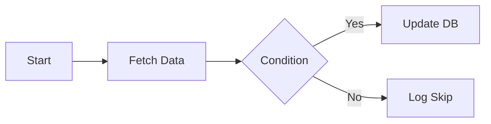
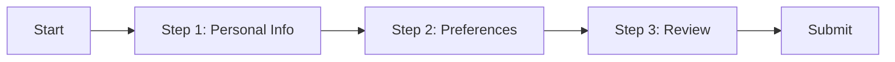
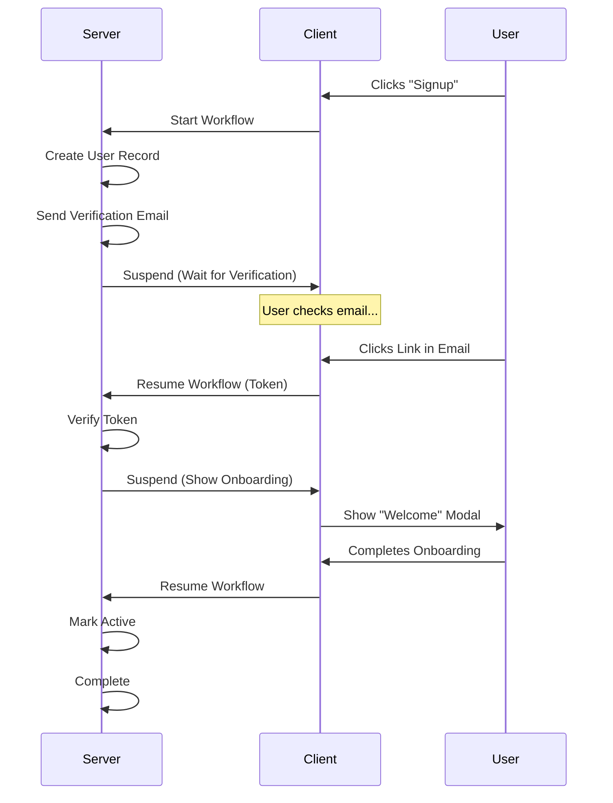

# Workflow Examples

Antigravity is flexible enough to handle various types of workflows. Here are a few common patterns.

## 1. Server-Only Workflow (Backend Automation)

This is a traditional workflow that runs entirely on the server without user intervention.

**Use Case**: Data processing, nightly jobs, webhook handling.

**Nodes used**:
- `start`: Triggered via API or Schedule.
- `http-request`: Fetch data from external API.
- `condition`: Check data values.
- `database-update`: Write to database.

## 2. Client-Only Workflow (Frontend Wizard)

You can use the engine to orchestrate complex frontend logic, keeping your UI components simple and focused.

**Use Case**: Multi-step signup form, product configurator.

**Nodes used**:
- `start`: Triggered by user click.
- `form-step`: Custom client node rendering a form.
- `validation`: Client-side validation node.

## 3. Hybrid Workflow ("The Hot Potato")

This is where Antigravity shines. Execution jumps between server and client.

**Use Case**: User Signup with Email Verification and Onboarding.

**Nodes used**:
- `server`: Create User, Send Email.
- `client`: Wait for Link Click (or specialized `wait-for-event` node).
- `server`: Verify Token.
- `client`: Onboarding Modal.
- `server`: Finalize.
